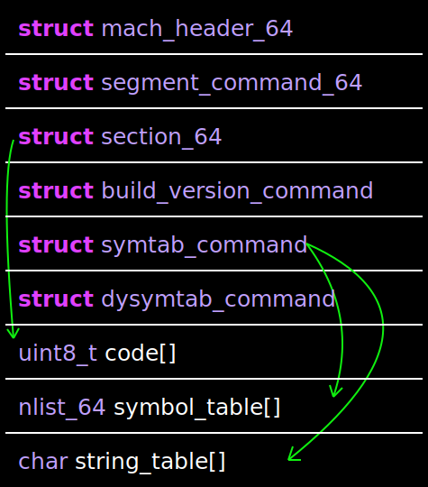

# Overview of Mach-O Files

> This is part two of a two-part series. [Part one](macho1.md) introduces the Mach-O file format and documents my learning process. These posts aim to help compiler designers who wish to emit Mach-O.

The Mach-O file format, albeit poorly documented, is quite simple. The file consists of a header, which identifies the file as Mach-O; an array of load commands, which lay down its structure; and data, such as code and strings. In this article, I will explain components of Mach-O files pertinent to creating a simple one that will behave like the following C program:

```c
int main() {
    return 42;
}
```
It may be helpful to refer to [the resulting file](resources/macho2-output.o) and [a detailed breakdown thereof](resources/macho2-machdump.txt) while reading this article. The below image shows the structure of the resulting file:



I will omit the necessary member access syntax, e.g., `member` in place of `value.member` or `value->member`, unless doing so will cause ambiguity.

## Table of Contents
1. Mach-O Header
2. Load Commands
    1. Segment Command
    2. Build Version Command
    3. Symbol Table Commands
3. A Simple Mach-O File

## Mach-O Header

A Mach-O file has a header with general information like many file formats.

```c
struct mach_header_64 {
    uint32_t magic;
    cpu_type_t cputype;
    cpu_subtype_t cpusubtype;
    uint32_t filetype;
    uint32_t ncmds;
    uint32_t sizeofcmds;
    uint32_t flags;
    uint32_t reserved;
};
```

The `magic` field identifies the object file as Mach-O. Set this field to `MH_MAGIC_64` for 64-bit headers. If the target's CPU has an endianness opposite the compiler's, set it to `MH_CIGAM_64`.

The `cputype` and `cpusubtype` fields specify the target's architecture. Set them to `CPU_TYPE_x86_64` and `CPU_SUBTYPE_X86_64_ALL` when targeting x86_64. The `filetype` field indicates the intended type of the file: set it to `MH_OBJECT` for normal object files and `MH_EXECUTE` for executables.

The `ncmds` and `sizeofcmds` fields delineate the load commands in the file. Set the `ncmds` field to the number of load commands and the `sizeofcmds` field to the number of bytes the load commands occupy. This size includes any sections that the load commands specifiy (more on load commands and sections later). Below is a table illustrating various scenarios:

Scenario | Values
-------- | ------
One segment without sections | `ncmds` = 1 and `sizeofcmds` = `sizeof(struct segment_command_64)`
One segment with two sections | `ncmds` = 1 and `sizeofcmds` = `sizeof(struct segment_command_64) + 2 * sizeof(struct section_64)`.
Two segments without sections | `ncmds` = 2 and `sizeofcmds` = `2 * sizeof(struct segment_command_64)`
One segment with one section and one segment with two sections | `ncmds` = 2 and `sizeofcmds` = `2 * sizeof(segment_command_64) + 3 * sizeof(struct section_64)`

The [docs](https://github.com/aidansteele/osx-abi-macho-file-format-reference/blob/master/Mach-O_File_Format.pdf) explain optional behaviors enabled with the `flags` field. They are not relevant for our purposes here, so set the field to zero. You may consult them if you are interested.

## Load Commands

Load commands describe the top-level structure of the file. They use "subtyping", i.e., they all share the same first two fields found in a `struct load_command_64` and can thus be cast to and from one.

```c
struct load_command_64 {
    uint32_t cmd;
    uint32_t cmdsize;
};
```

The `cmd` field identifies the load command subtype and the `cmdsize` field represents the total size of the command. See [here](resources/macho2-loadcmd.svg) for a pictorial representation. Although there are many load commands, I will only describe the essential ones.

### Segment Command

The segment command adds a new segment to the process. Segments contain sections, which point to code, strings, or other such data.

```c
struct segment_command_64 {
    uint32_t cmd;
    uint32_t cmdsize;
    char segname[16];
    uint64_t vmaddr;
    uint64_t vmsize;
    uint64_t fileoff;
    uint64_t filesize;
    vm_prot_t maxprot;
    vm_prot_t initprot;
    uint32_t nsects;
    uint32_t flags;
};
```

Set the subtyping as follows:

Field | Value | Description
----- | ----- | -----------
`cmd` | `LC_SEGMENT_64` | A magic number that identifies this load command.
`cmdsize` | `sizeof(struct segment_command_64) + ncmds * sizeof(struct section_64)` | The size of this segment plus the sizes of all the sections that immediately follow it.

You can ignore the `segname` field because each section specifies which segment it belongs to. I recommend that you set this to an array of 16 zeros.

The `vmaddr` and `vmsize` fields refer to the resulting address and size of the segment in the process. If you want this segment to be the first in the process, set `vmaddr` to zero and `vmsize` to the total size of the segment data.

The `fileoff` and `filesize` fields mirror the virtual ones; they specify the region in the file (`fileoff` up to `fileoff + filesize`) that maps to the corresponding one in the process (`vmaddr` up to `vmaddr + vmsize`).

The `initprot` and `maxprot` fields designate the initial and maximum virtual memory protections for this segment in the process, e.g., `PROT_READ`, `PROT_WRITE`, and `PROT_EXEC`. The operating system may ignore these fields and designate its protections.

The the `nsects` field is similar to the segment's `ncmds` field; it enumerates the number of sections following the segment, which are defined as follows:

```c
struct section_64 {
    char sectname[16];
    char segname[16];
    uint64_t addr;
    uint64_t size;
    uint32_t offset;
    uint32_t align;
    uint32_t reloff;
    uint32_t nreloc;
    uint32_t flags;
    uint32_t reserved1;
    uint32_t reserved2;
};
```

The `segname` field indicates the segment's name, and the `sectname` field indicates the section's. Set them to a null-terminated string of at most 15 characters.

Certain segment names are special; for example, `__TEXT` refers to the code segment, and `__DATA` refers to the data segment. Certain section names are also special; for instance, `__text` refers to a code section, and `__data` refers to a data section. The `__TEXT` segment can also have a `__cstring` section (for literal string constants) and `__const` for constants. In a similar vein, the `__DATA` segment can have a `__bss` for zero-initialized data. There is a full list of segment and section names on [this archived webpage](https://developer.apple.com/library/archive/documentation/Performance/Conceptual/CodeFootprint/Articles/MachOOverview.html).

The `addr` field of the section mirrors the `vmaddr` field of the segment; it places the section at the `segment.vmaddr + section.addr`th byte in virtual memory.

The `size` and `offset` fields locate the section data in the object file, not in virtual memory. These bytes are copied into virtual memory starting at the `addr` described above.

The `align` field defines the alignment of the section. Set this field to an exponent; the actual alignment will be `1 << align`.

The `reloff` and `nreloc` fields frame an array of relocation entries for the section. You can read more about them [in the docs](https://github.com/aidansteele/osx-abi-macho-file-format-reference#relocation-data-structures).

The `flags` field has a variety of options that the [docs](https://github.com/aidansteele/osx-abi-macho-file-format-reference#fields-6) explain under the subheading entitled "flags". Set this field to `S_ATTR_PURE_INSTRUCTIONS | S_ATTR_SOME_INSTRUCTIONS` for sections with code.

Set the fields `reserved1` and `reserved2` to zero. Set them to the number and size of the symbol stub entries for the section if you set `flags & S_SYMBOL_STUBS`.

### Build Version Command

The build version command specifies the environment where the object file will operate. This environment includes OS versions, SDK versions, and build tool versions.

```c
struct build_version_command {
    uint32_t cmd;
    uint32_t cmdsize;
    uint32_t platform;
    uint32_t minos;
    uint32_t sdk;
    uint32_t ntools;
};
```

Set the subtyping fields as follows:

Field | Value | Description
----- | ----- | -----------
`cmd` | `LC_BUILD_VERSION` | A magic number that identifies this load command.
`cmdsize` | `sizeof(struct build_version_command) + ntools * sizeof(struct build_tool_version)` | The size of this load command and to the sizes of the build tool versions which follow it.

The `platform` field specifies the target platform. Set this field to `PLATFORM_MACOS` if emitting for MacOS.

The `minos` field provides the minimum operating system version that the file supported. [Both this field and the `sdk` one are packed as nibbles]((https://llvm.org/docs/doxygen/BinaryFormat_2MachO_8h_source.html#l00860)) (sequences of 4 bits) in the format `xxxx.yy.zz` where the variables form a version `X.Y.Z`. I have yet to find any information on the `sdk` field, but I find that setting it to zero works.

The `ntools` field indicates the number of `struct build_tool_version`s following it.

```c
struct build_tool_version {
    uint32_t tool;
    uint32_t version;
};
```

Set the `tool` field to a build tool:

- `TOOL_CLANG`
- `TOOL_SWIFT`
- `TOOL_LD`

Set the version field to a one in the same `xxxx.yy.zz` nibbles format as the versions in the build version command.

### Symbol Table Commands

The Mach-O symbol table is defined through two load commands: `struct symtab_command` and `struct dysymtab_command`.

#### Symbol Table Command

```c
struct symtab_command {
	uint32_t cmd;
	uint32_t cmdsize;
	uint32_t symoff;
	uint32_t nsyms;
	uint32_t stroff;
	uint32_t strsize;
};
```

Set the subtyping fields as follows:

Field | Value | Description
----- | ----- | -----------
`cmd` | `LC_SYMTAB` | A magic number that identifies this load command.
`cmdsize` | `sizeof(struct symtab_command)` | The size of this load command.

The `symoff` field locates the symbol table in the object file. This table is an array of symbol entries and the `nsyms` field represents the number of symbol entries. These entries are of type `nlist_64`, which I explain at the end of this section.

The `stroff` field also locates a table in the object file–namely, the string table. The `strsize` field specifies the size of this table.

#### Dynamic Symbol Table Command

```c
struct dysymtab_command {
    uint32_t cmd;
    uint32_t cmdsize;
    uint32_t ilocalsym;
    uint32_t nlocalsym;
    uint32_t iextdefsym;
    uint32_t nextdefsym;
    uint32_t iundefsym;
    uint32_t nundefsym;
    uint32_t tocoff;
    uint32_t ntoc;
    uint32_t modtaboff;
    uint32_t nmodtab;
    uint32_t extrefsymoff;
    uint32_t nextrefsyms;
    uint32_t indirectsymoff;
    uint32_t nindirectsyms;
    uint32_t extreloff;
    uint32_t nextrel;
    uint32_t locreloff;
    uint32_t nlocrel;
};
```

Set the type punning fields as follows:

Field | Value | Description
----- | ----- | -----------
`cmd` | `LC_DYSYMTAB` | A magic number that identifies this load command.
`cmdsize` | `sizeof(struct dysymtab_command)` | The size of this load command.

The following fields come in pairs and group the symbol table by specifying a starting index and a length. The index is the former, and the length is the latter.

Field Pair | Group
---------- | -----
`ilocalsym` and `nlocalsym` | Local symbols.
`iextdefsym` and `nextdefsym` | Defined external symbols.
`iundefsym` and `nundefsym` | Undefined external symbols.

The remaining fields also come in pairs and locate other tables of symbol information in the object file by specifying a starting offset and a size. The offset is the former; the size is the latter.

Field Pair | Table
---------- | -----
`tocoff` and `ntoc` | [Table of contents](https://github.com/aidansteele/osx-abi-macho-file-format-reference#dylib_table_of_contents).
`modtaboff` and `nmodtab` | [Module table](https://github.com/aidansteele/osx-abi-macho-file-format-reference#dylib_module_64).
`extrefsymoff` and `nextrefsyms` | [External reference table](https://github.com/aidansteele/osx-abi-macho-file-format-reference#dylib_module_64).
`indirectsymoff` and `nindirectsyms` | Indirect symbol table.
`extreloff` and `nextrel` | [External relocation table](https://github.com/aidansteele/osx-abi-macho-file-format-reference#dylib_module_64).
`locreloff` and `nlocrel` | [Local relocation table](https://github.com/aidansteele/osx-abi-macho-file-format-reference#dylib_module_64).

#### Nlist

```c
struct nlist_64 {
    union {
        uint32_t n_strx;
    } n_un;
    uint8_t n_type;
    uint8_t n_sect;
    uint16_t n_desc;
    uint64_t n_value;
};
```

Set the `n_un.n_strx` field to the offset in the string table of the symbol's associated string.

The `n_type` field is a set of flags consisting of 4 groups.

```c
8 bits: ssspttte
s = N_STAB
p = N_PEXT
t = N_TYPE
e = N_EXT
```

Subfield | Flag | Effect
-------- | ---- | -----------
`N_STAB` | `N_STAB` | If any of these bits are set, the symbol is a debugging entry.
`N_PEXT` | `N_PEXT` | The symbol is private and external. (?)
`N_TYPE` | `N_UNDF` | The symbol is undefined. The `n_sect` field is zero.
`N_TYPE` | `N_ABS` | The symbol is absolute. The `n_sect` field is zero.
`N_TYPE` | `N_SECT` | The symbol can be found in in the section `n_sect`.
`N_TYPE` | `N_PBUD` | The symbol is defined in a dynamic library.
`N_TYPE` | `N_INDR` | The symbol is indirect.
`N_EXT` | `N_EXT` | The symbol is externally visible.

The `n_sect` field indicates the section in which the symbol is defined, starting at 1. `NO_SECT`, or zero, indicates that the symbol is not defined in any section. `MAX_SECT`, or 255, is the maximum section number.

I cannot find any information on the `n_desc` field (see the Hall of Shame section in the [first post on Mach-O](macho1.md)). I find that setting this field to zero works.

The `n_value` field represents the address associated with the symbol. Set this field to an address in virtual memory.

## A Simple Mach-O File

(work in progress)

_Copyright (C) 2021 Ethan Uppal. All rights reserved._
